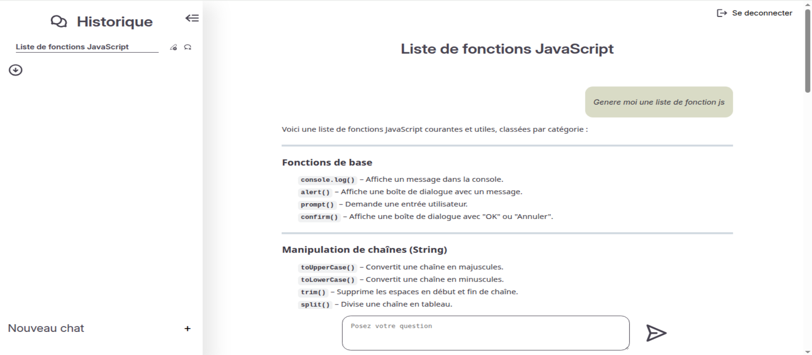

# 🤖 Ochat front - SPA avec Svelte

**Ochat** est une Single Page Application permettant de discuter avec l'IA Mistral.

👉 [Voir la démo en ligne](https://ochat-front.vercel.app/)

👉 [Accèder au repo du backend](https://github.com/SebastienCHAUVEL/ochat-api)

---

---

## 🎯 Objectifs du projet

Ce projet démontre :

- La création d'interfaces réactives avec Svelte
- L'intégration d'un backend pour un projet fullstack
- La gestion d'état avancée
- L'authentification sécurisée
- La création d'une expérience utilisateur fluide
- Le responsive design

---

## 🛠 Technologies utilisées

- Svelte
- CSS
- Iconify (Bibliothèque d'icônes)
- svelte-exmarkdown (Rendu Markdown)

## 🚀 Fonctionnalités implémentées

1. Chat avec l'API mistral(requêtes effectué depuis le backend):
   - **Envoi de messages** en temps réel
   - **Affichage des réponses** avec rendu Markdown
   - **Indicateurs de chargement**
   - **Défilement automatique** à l'envoie/reception d'un message
   - **Gestion des erreurs** (messages clairs)

2. Authentification:
   - **Inscription** avec validation des mots de passe
   - **Connexion** sécurisée (JWT dans les cookies)
   - **Mode invité** (sans gestion de conversation)
   - **Gestion des erreurs** (messages clairs)

3. Gestion des conversations:
   - **Géneration de titre** automatique en fonction du contexte à l'envoi de la premiere question
   - **Géneration d'une nouvelle conversation** automatique à l'envoie de la premiere question
   - Ajout, suppression, modification du titre

4. Slider pour la gestion des conversations:
   - **Burger button** pour afficher/masquer le slider
   - **Bouton de défilement** pour afficher/masquer les anciennes conversations

## Mockup

Mockup réalisé avec **figma** au début du projet qui représente :

- L'organisation/disposition des éléments de l'interface
- Les principales interactions (affichage des messages, envoi de messages)
- La structure globale de l'application

